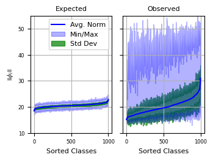
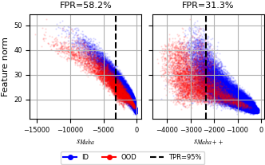
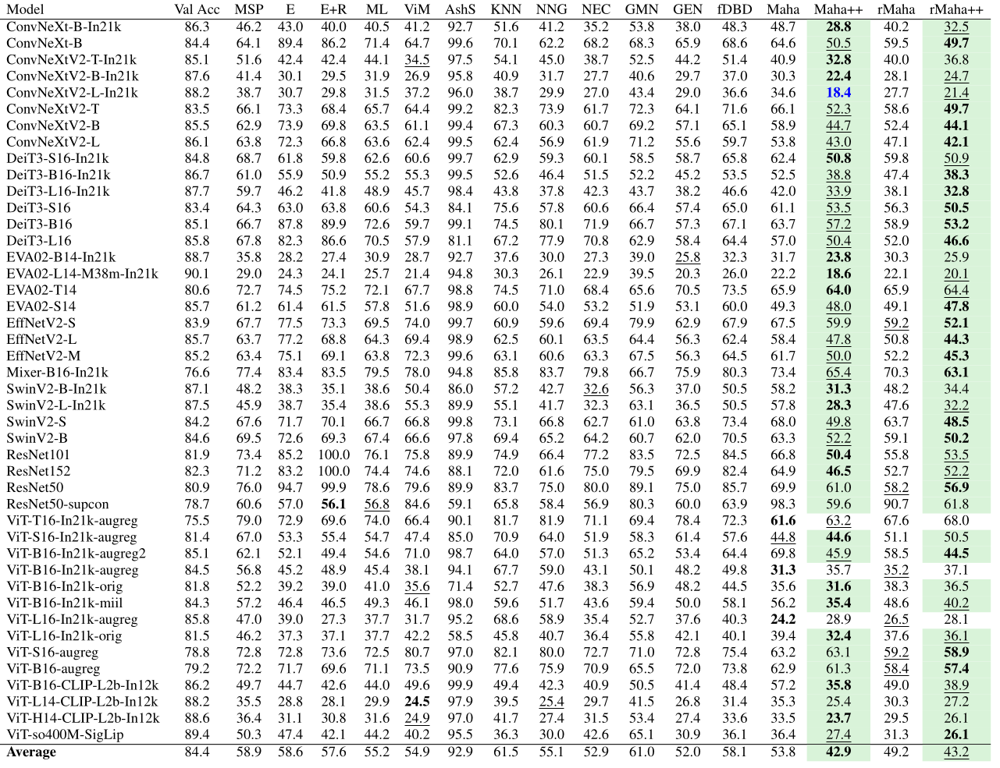

# [Mahalanobis++: Feature Normalization as the Missing Ingredient for Reliable OOD Detection](TBD)

Maximilian Müller, Matthias Hein

**University of Tübingen**  
**Tübingen AI Center**


Paper: [TBD](TBD)  

## Paper abstract

Detecting out-of-distribution (OOD) examples is an important task for deploying reliable machine learning models in safety-critial applications. 
While post-hoc methods based on the Mahalanobis distance applied to pre-logit features are among the most effective for ImageNet-scale OOD detection, their performance varies significantly across models. We connect this inconsistency to strong variations in feature norms, indicating severe violations of the Gaussian assumption underlying the Mahalanobis distance estimation. We show that simple $\ell_2$-normalization of the features mitigates this problem effectively, aligning better with the premise of normally distributed data with shared covariance matrix. Extensive experiments on 44 models across diverse architectures and pretraining schemes show that $\ell_2$-normalization improves the conventional Mahalanobis distance-based approaches significantly and consistently, and outperforms other recently proposed OOD detection methods.


<table>
  <tr>
    <td>
      
    </td>
    <td>
      
    </td>
  </tr>
  <tr>
    <td colspan="2" style="text-align: center; padding-top: 10px; max-width: 600px;">
      <b>Left: The Gaussian assumption may be severely violated.</b> We simulate how the feature norms per class would be distributed if they were sampled from Gaussians with the means and covariance matrix used for the Mahalanobis distance estimation. The feature norm distribution observed in practice differs strongly, as both the average norms across classes and the norms within each class vary much stronger than expected.<br><br>
      <b>Right: Normalization improves dependence of OOD score on feature norm.</b> For non-normalized features, the smaller the feature norm, the smaller the Mahalanobis OOD score, irrespective of whether a sample is ID or not. OOD samples with small feature norms are systematically classified as ID.  After normalization, OOD samples with small feature norms can be detected, and OOD detection is significantly improved.
    </td>
  </tr>
</table>

## **Using this repository**:
````
# install packages
conda env create -f ninco_maha.yml
conda activate NINCO_maha
pip install libmr==0.1.9

# go to NINCO folder and download NINCO data
cd NINCO
wget https://zenodo.org/record/8013288/files/NINCO_all.tar.gz?download=1 -O NINCO_all.tar.gz
tar -xvzf NINCO_all.tar.gz
````

Then please edit `NINCO/data/paths_config.py` to set `ninco_folder` to the folder where the downloaded NINCO datasets have been extracted (containing the folders `NINCO_OOD_classes`,  `NINCO_OOD_unit_tests` and  `NINCO_popular_datasets_subsamples`).
Also, set `repo_path` to the absolute path of the NINCO repository, and specify the correct ImageNet path.

## Method
The usual Mahalanobis distance for OOD detection, but with normalized features:
```python
def evaluate_Mahalanobis_norm(feature_id_train, feature_id_val, feature_ood, train_labels, path):
    """
    feature_id_train (numpy array): ID train samples, (n_train x d).
    feature_id_val (numpy array): ID val samples, (n_val x d).
    feature_ood (numpy array): OOD samples (n_ood x d)
    train_labels (numpy array): The labels of the in-distribution training samples.
    Returns:
    tuple: The Mahalanobis scores for in-distribution validation and out-of-distribution samples.
    """
    # normalize features
    feature_id_val = feature_id_val/np.linalg.norm(feature_id_val,axis=-1,keepdims=True)
    feature_ood = feature_ood/np.linalg.norm(feature_ood,axis=-1,keepdims=True)
    feature_id_train = feature_id_train/np.linalg.norm(feature_id_train,axis=-1,keepdims=True)

    # estimate mean and covariance 
    train_means = []
    train_feat_centered = []
    for i in tqdm(range(1000)):
        fs = feature_id_train[train_labels == i]
        _m = fs.mean(axis=0)
        train_means.append(_m)
        train_feat_centered.extend(fs - _m)
    ec = EmpiricalCovariance(assume_centered=True)
    ec.fit(np.array(train_feat_centered).astype(np.float64))
    mean = np.array(train_means)
    prec = (ec.precision_)
    mean = torch.from_numpy(mean).cuda().double()
    prec = torch.from_numpy(prec).cuda().double()

    # compute Scores
    score_id = -np.array([(((f - mean) @ prec) * (f - mean)).sum(axis=-1).min().cpu().item() for f in
                              tqdm(torch.from_numpy(feature_id_val).cuda().double())])
    score_ood = -np.array([(((f - mean) @ prec) * (f - mean)).sum(axis=-1).min().cpu().item() for f in
                           tqdm(torch.from_numpy(feature_ood).cuda().double())])
    return score_id, score_ood
```

## Run evaluation
Evaluate a SwinV2-base model with Mahalanobis++. 
````
python3 evaluate.py --model_name swinv2_base_window12to24_192to384.ms_in22k_ft_in1k --method all --dataset NINCO --batch_size 128
````
Note that this takes considerable time since on a model's first run it requires a forward pass over the whole ImageNet-1K train set to extract the train features. Specifying `--method all` evaluates all methods. 

## Results


Normalizing the features improves Mahalanobis-based OOD detection consistently, and Mahalanobis with normalized features leads to the best methods on average, and also for most models individually. Shown are FPR values on NINCO.


## Citation
For citing our paper, we would appreciate using the following bibtex entry (this will be updated once the ICML 2025 proceedings are public):
```
TBD
```
Since this repo is based on the NINCO repo and the OpenOOD repo, please consider citing their work, too:

```
@inproceedings{
bitterwolf2023ninco,
title={In or Out? Fixing ImageNet Out-of-Distribution Detection Evaluation},
author={Julian Bitterwolf and Maximilian Mueller and Matthias Hein},
booktitle={ICML},
year={2023},
url={https://proceedings.mlr.press/v202/bitterwolf23a.html}
}

@article{zhang2023openood,
  title={OpenOOD v1.5: Enhanced Benchmark for Out-of-Distribution Detection},
  author={Zhang, Jingyang and Yang, Jingkang and Wang, Pengyun and Wang, Haoqi and Lin, Yueqian and Zhang, Haoran and Sun, Yiyou and Du, Xuefeng and Li, Yixuan and Liu, Ziwei and Chen, Yiran and Li, Hai},
  journal={arXiv preprint arXiv:2306.09301},
  year={2023}
}
```
